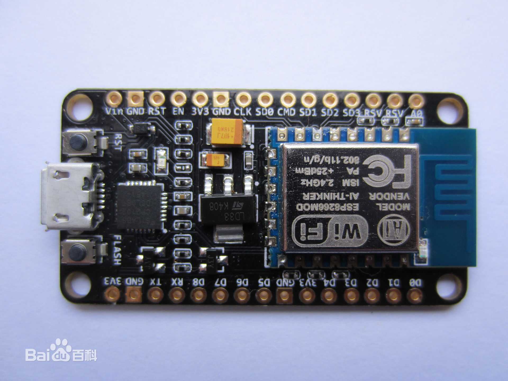

# 十天DIY智能灯(引言)

如果你之前有过硬件开发的基础,可以跳过本篇.

首先, 我们要了解一个单片机, 也即NodeMCU.

我们需要把USB线插入它的usb接口中, 然后把适用于单片机的操作系统, 也就是`固件`, 下载到nodeMCU中.
  
准备工作完成后, 我们将用nodeMCU连接wifi **(注意: 2.4GHz频段)**.
先进的Wifi路由器往往可以选择两个频段, 2.4GHz或者5GHz.

## 单片机基本知识
## 一.引脚
### 我们将单片机上的插孔称为"引脚"(pin), 引脚分为多种.  
`GND`意味地线, 你将把它连接到电源的负极, 我们称之为低电平.  
`Vin/VCC/3.3V/5V`都意味着正极, 我们将它连接到电源的正极.  
通常情况下, 单片机通电后即可开始工作.  

`RX`与`TX`是单片机与电脑(也称为`上位机`)沟通的渠道. 这种通信协议被称为串口(`serial`)协议.
`RX`代表`Recieve data`, `TX`代表`Transmit data`.   
在串口协议中有一个重要的参数, 波特率(`Baud rate`), 可以理解为传输速率.  **只有当单片机与上位机用同样的波特率交换数据时, 数据才能被正常解析.**   
在NodeMCU中你不必操心串口问题,nodeMCU使用CH340芯片,将串口信号转为USB信号,插入USB线即可使用!**默认波特率:115200.**  
`RST`意为`Reset`, 顾名思义, 当该引脚被拉高(接电源正极)时, 即可重启单片机.
## 二.固件
固件也就是单片机的操作系统.  
我们需要把固件写入(`烧录`)到单片机内部, 之后再运行我们的用户代码.  
## 三.烧录
烧录就是用软件, 把固件传入单片机, 上传固件的软件被称为`Flasher`. 
