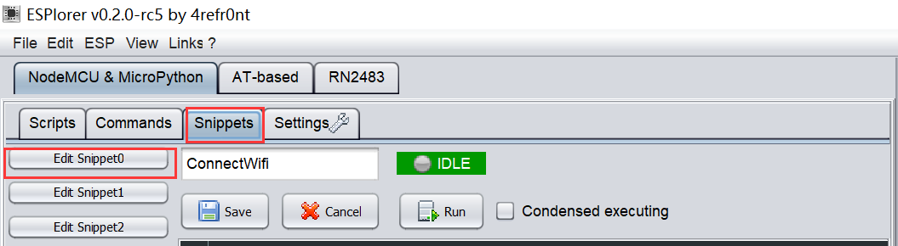
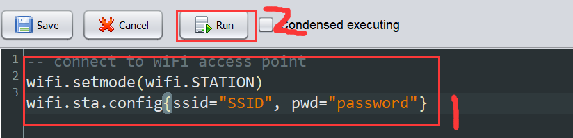

## nodeMCU是什么  
******  
NodeMCU是一个开源的物联网平台, 它使用Lua脚本语言编程. 基于ESP8266芯片.

## 起步
*****
首先, 我们需要如下几个软件: `(以下给出了下载地址)`   

1. NodeMCU的烧录器:  
windows: https://github.com/marcelstoer/nodemcu-pyflasher  
Mac: https://github.com/marcelstoer/nodemcu-pyflasher
2. NodeMCU的固件:  
你可以从[此地址](http://nodemcu-build.com/)自由构建一个可选择功能的固件镜像, 也可以使用我们提供的镜像(稍后添加), 包含了本实验需要的基本模块.  
基本模块如下: adc, file, gpio, i2c, net, node, pwm, sjson, tmr, uart, wifi.
3. NodeMCU的编程器(IDE):  
[ESPlorer](https://esp8266.ru/esplorer/)是NodeMCU的IDE, 可以轻松完成配置, 代码上传, 调试等工作.

## 烧录固件
**********
http://nodemcu.readthedocs.io/en/dev/en/flash/
按照官网教程操作,烧录进固件到NodeMCU

## 连接Wi-Fi
*********
```Lua
-- connect to WiFi access point
wifi.setmode(wifi.STATION)
wifi.sta.config{ssid="SSID", pwd="password"}
```
ESPlorer提供了实时调试的功能, 按图示操作, 可以让NodeMCU接入附近的Wi-Fi.



## 控制LED开关(GPIO)
*****************
将LED按照图示电路接好, 然后在Snippet2运行以下代码.
```Lua
local pin = 5 
gpio.mode(pin, gpio.OUTPUT)
gpio.write(pin, gpio.HIGH)
```
点亮LED.

## 调整LED亮度
****************
调整LED亮度需要用到`PWM`模块. PWM是脉冲宽度调制的简称, 通过调整占空比来调整平均电流大小, 从而调整LED的亮度.
```Lua
pwm.setup(5, 500, 512)
pwm.start(5)
pwm.setduty(5, 200)
```
在控制台输入`pwm.setduty(5, 1000)`即可调整LED亮度, 更多对于`PWM`的支持请参阅[官方文档](http://nodemcu.readthedocs.io/en/dev/en/modules/pwm/).

## JSON解析
*******************

## 先修知识
### JSON
> `JSON`(`JavaScript Object Notation, JS 对象简谱`) 是一种轻量级的数据交换格式。它基于 ECMAScript (欧洲计算机协会制定的js规范)的一个子集，采用完全独立于编程语言的文本格式来存储和表示数据。

`{"cmd":"openlight"}`就是一个合法的JSON文本.非常易于理解   
我们将会用到的json格式, 形如:
```JSON
{"cmd":"setBrightness", "args":100}
{"name":"light001", "ip":"192.168.31.2", "red":0, "green":0, "blue":0}
```
### Lua Table
>table 是 Lua 的一种数据结构, 用来帮助我们创建不同的数据类型，如：数组、字典等

`table0 = {"cmd"="openlight"}` 是一个合法Lua语句, 该语句定义了一个表`table0`, 并且, `table0["cmd"] = "openlight"`. 同样非常易于理解. 
该语句等价于:  
```Lua
table0 = {}
table0["cmd"] = "openlight" --or table0.cmd = "openlight"
```

## 用NodeMCU实现json与table的转换
```Lua
local str = '{"cmd":"openlight"}' 
--单引号表示字符串可以省去双引号前的转义符
local table0 = sjson.decode(str)
print(table0.cmd)     -- openlight
print(table0["cmd"])  -- openlight
local result = sjson.encode(table0)
print(result)  -- {"cmd":"openlight"}
```

我们将使用nodeMCU发送json数据到树莓派, 并使用NodeMCU接受json数据并解析.  