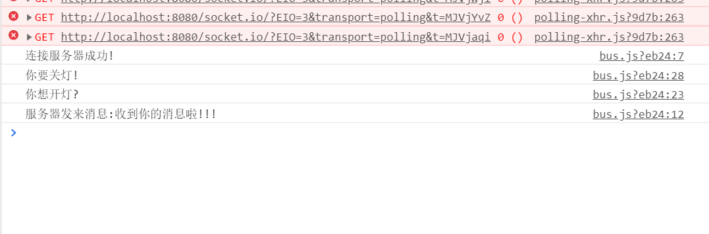

# 为智能灯准备Web后台
如同第六篇, 下载项目
```Bash
git clone https://github.com/1079805974/NodeMCULightBackground.git
```
用`VS Code`打开文件夹.打开`./bin/LampServer.js`,运行.
> 控制台输出:服务器启动成功!

转到前端界面, 选择一个灯, 点击开关, 即可给服务器发送消息, 相关代码在`./bus.js`中, 可以自行查看.效果如下.


此处代码:
