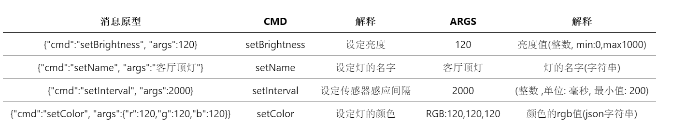

## 通讯协议的学习与设计
******************

### 本文章将实现NodeMCU与局域网内你的电脑的通信. 然后我们可以把你电脑中的程序部署到树莓派上, 从而实现NodeMCU与边缘网关的通信. 
### 另外, 我们还展示了一种可能的通讯协议,实现灯的控制和对环境的感知, 以及一种消息解析器的设计.

## 设计通信协议
### 设计一个通信协议, 实现灯的控制和对环境的感知.
当然设计方法有很多种, 具体实现细节也有很多, 各位可以尽情发挥, 这里仅提供一种可能的设计.  
首先, 所有的消息由一个json字符串构成.  
最外层对象包含两个特定的key: `cmd`和`args`,分别代表命令和参数.  
+ `cmd`的值为一个字符串, 代表NodeMCU将要执行的命令.  
+ `args`的值可以为整数, 字符串, json字符串, 代表当前命令的参数.  

全部示例如下:



## 推荐的消息解析器设计(需要添加自动重连功能)
下面是推荐的消息解析器设计, 通过dis数组和dispatch函数对命令进行分发.  
消息解析器只是一种编程技巧, 直接的实现方式如下:
只实现了`setName`和`setBrightness`命令

```Lua
function setName(name)
   -- your code
end

function setBrightness(pack)
   -- your code
end

sk = net.createConnection(net.TCP, 0)
sk:connect(10086, '192.168.3.3')
sk:on("disconnection", function(c)end)
sk:on("receive", function(sck, msg)
    local pack = sjson.decode(message)    
    if pack.cmd == 'setName' then  
        setName(pack.name)    
    elseif pack.cmd == 'setBrightness' then
        setBrightness(pack.brightness)       
    end
end)
sk:on("connection", function(sck, c)
    print('connected')
end)
```
下面介绍一种比较推荐的实现方式.
 首先, 我们使用一个名为dis的`Lua Table`储存相应的处理函数.
```Lua
    dis = {}
    dis['setName'] = setName
    dis['setBrightness'] = setBrightness 
    --dis(数组下标) = 函数引用
```
如果要调用`setName`函数, 可以写作 `dis['setName']()`
然后, 用`dispatch`函数分发服务器传来的命令.

```Lua
function setName(pack)
   -- your code
end

function setBrightness(pack)
   -- your code
end

dis = {}

function dispatch(client, message)         --分发函数
     print("receive message: "..message)   --将收到的内容打印
     local pack = sjson.decode(message)    --解析消息
     if pack.cmd~=nil and dis[pack.cmd] then   --如果消息的'cmd'不为空
          dis[pack.cmd](pack)              --调用与cmd内容同名的函数
     end
end

dis['setName'] = setName
dis['setBrightness'] = setBrightness

sk = net.createConnection(net.TCP, 0)
sk:connect(10086, '192.168.3.3')
sk:on("disconnection", function(c)end)
sk:on("receive", dispatch) --收到消息时,直接调用dispath函数
sk:on("connection", function(sck, c)
    print('connected')
end)

```

假设服务器传来消息`{"cmd":"setBrightness", "args":120}`,`dispath`函数解析后, `pack.cmd = 'setBrightness'`, 调用`dis['setBrightness'](pack)`, 也就是调用`setBrightness`函数, 这样在`setBrightness`函数中就可以通过`pack.args`获得`120`这个值.  

假设服务器传来消息`{"cmd":"setColor", "args":{"r":120,"g":120,"b":120}}`,`dispath`函数解析后, 在`setColor`函数中就可以通过`pack.args.r`获得红灯亮度值.

**加函数时, 不要忘记加映射, dispatch['set\*\*\*']=set\*\*\***