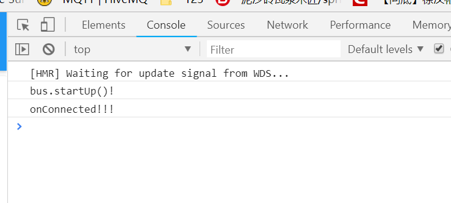

# 外网通信

## MQTT版本的服务器和客户端和websocket完全分开,MQTT版本客户端将部署到我们的外网服务器上,做完之后可以把dist和index.html发我,服务端部署在树莓派上!

## 学习MQTT协议

https://cloud.baidu.com/doc/IOT/GettingStarted.html

## 修改bus.js, 使前端支持MQTT
在Web前端文件夹中运行`npm install paho-mqtt -s`. 
下载群文件中的`bus.js`替换`bus.js`. 
按照注释修改`clientId`和`topic`.   
下载群文件中的`paho-mqtt.js`或者`https://raw.githubusercontent.com/eclipse/paho.mqtt.javascript/master/src/paho-mqtt.js`替换`./NodeMCULightWeb/node_modules/paho-mqtt/paho-mqtt.js`  
运行`npm run dev`,访问`localhost:8081`.  
效果:


## 自行修改bus.js

## 修改config文件夹下的index.js

打开文件找到图中代码：

将图中最后一行`assetsPublicPath`中的`'/'`改为`'./'`

## 修改后台代码, 使其支持MQTT
在后台运行`npm install -s mqtt`安装`mqtt`支持.  
下载群文件中`mqtt.js`, 放到`bin`文件夹下.  
修改`topic`和`clientId`.

## 在LampServer.js中使用
```JavaScript
const webs = require('./WebSocket')
```
修改为
```JavaScript
const webs = require('./mqtt')
```
即可

## 重新打包Web前端
打包方法参考第八篇教程第三步以后的步骤

## 将NodeMCULightWeb中dist文件夹添加到压缩包发给助教
坐标：QQ群里`东大 65组 李井瑞`
私发就行
压缩包备注一下组号ヾ(ｏ･ω･)ﾉ

等李井瑞同学在群里分享链接之后就可以自己尝试控制小灯啦(￣▽￣)~*