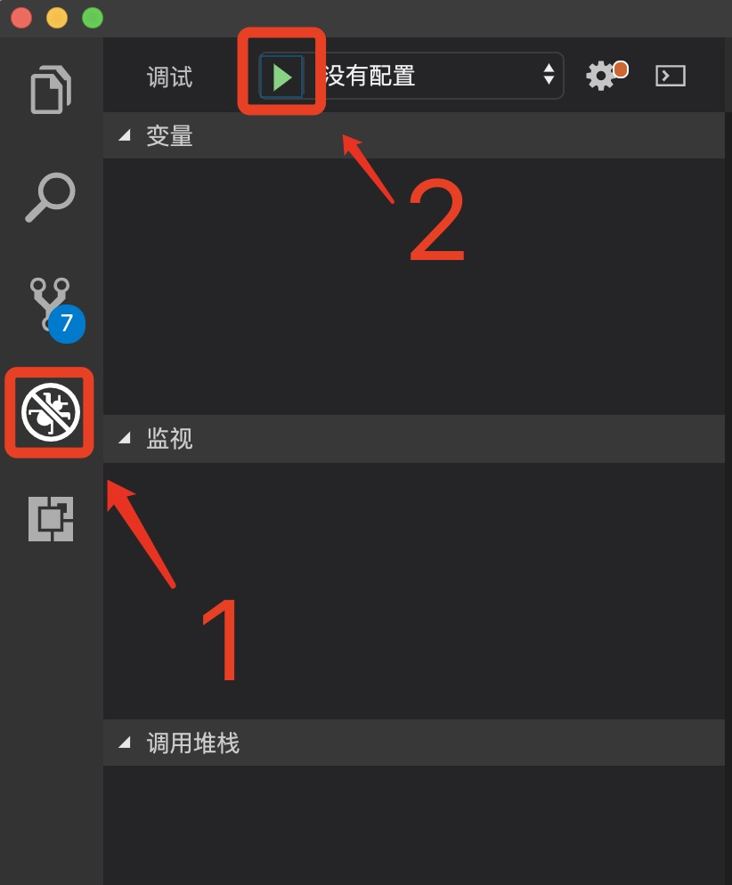
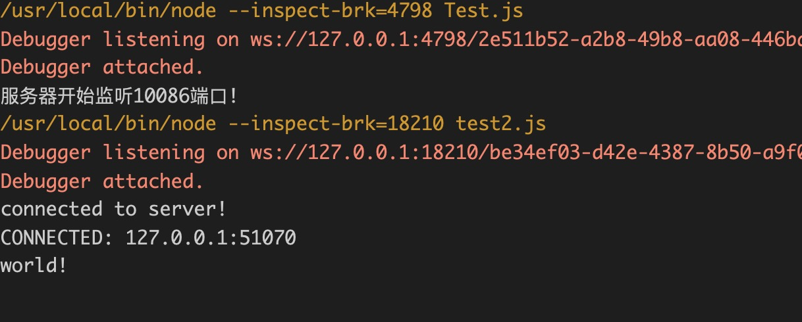
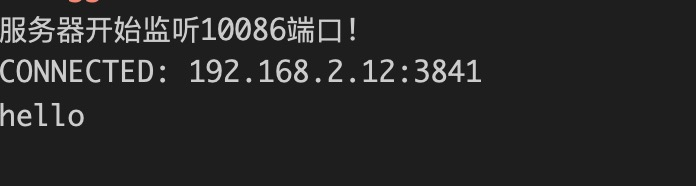
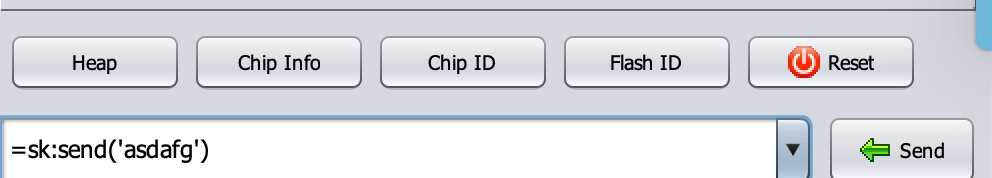

# 电脑与NodeMCU通过Wifi传输数据

1. 首先将电脑连接到手机热点, 获取电脑IP,(百度:Windows怎么看IP).  
2. 我们使用`Node.js`来编程接收数据,因此需要先安装`Node.js`.([安装Node.js](https://www.runoob.com/nodejs/nodejs-install-setup.html))  

3. 写好监听代码:([官网教程](http://nodejs.cn/api/net.html))
```JavaScript
var net = require('net')

var PORT = 10086
var HOST = '0.0.0.0'
net.createServer(function (socket) {
    console.log('CONNECTED: ' +
        socket.remoteAddress + ':' + socket.remotePort)

    socket.on('data', function (data) {
        console.log(data) //打印所有数据到控制台
        socket.write('客户端你好!')
    });

    socket.on('close', function (data) {
        console.log('CLOSED: ' +
            socket.remoteAddress + ' ' + socket.remotePort)
    });

}).listen(PORT, HOST);
console.log('服务器开始监听10086端口!')
```
将代码保存为`ServerTest.js` (建议用VS Code编辑,请下载VS Code.), 在控制台中输入 `node ServerTest.js`.  
如果使用VS Code, 打开ServerTest.js按照下图操作.

运行效果:


4. 用客户端代码测试服务器代码:
```JavaScript
const net = require('net');
const client = net.createConnection({ port: 10086 }, () => {
  //'connect' listener
  console.log('connected to server!');
  client.write('world!\r\n');
});
client.on('data', (data) => {
  console.log(data.toString());
  client.end();
});
client.on('end', () => {
  console.log('disconnected from server');
});
```
将代码保存为`ClientTest.js` (建议用VS Code编辑,请下载VS Code.), 在控制台中输入 `node ClientTest.js`.  
如果使用VS Code, 操作同上.

如果服务器和客户端同时打开,就会看到如下效果:(黄色和红色的字可能不一样)


现在关闭客户端, 在NodeMCU中运行以下代码:
```Lua
if wifi.sta.getip()==nil then
     wifi.setmode(wifi.STATION)
     wifi.sta.config{ssid='wifi名字', pwd='密码'}
end
SERVER_PORT = 10086
SERVER_IP = '电脑IP'
sk = net.createConnection(net.TCP, 0)
sk:on("disconnection", function(c)
    print('disconnect')
end)
sk:on("receive", function(m)
     print(m)
end)
sk:on("connection", function(sck, c)
     sk:send('hello')
     print('connected')
end)
sk:connect(SERVER_PORT, SERVER_IP)
```
服务器效果如下:

在这里输入文字:

发送你想发送的任何消息!
比如:光照亮度!