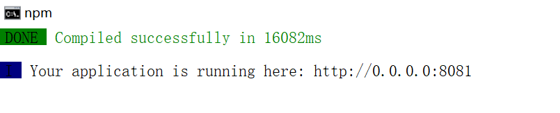
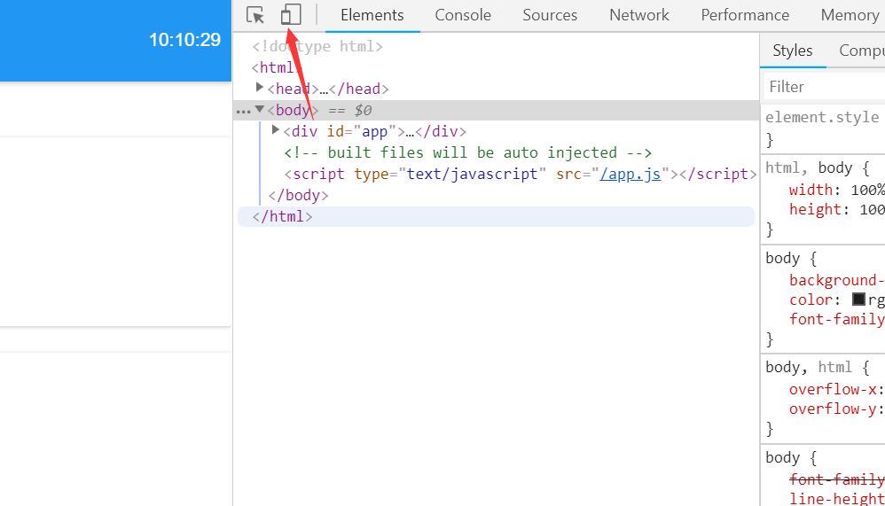
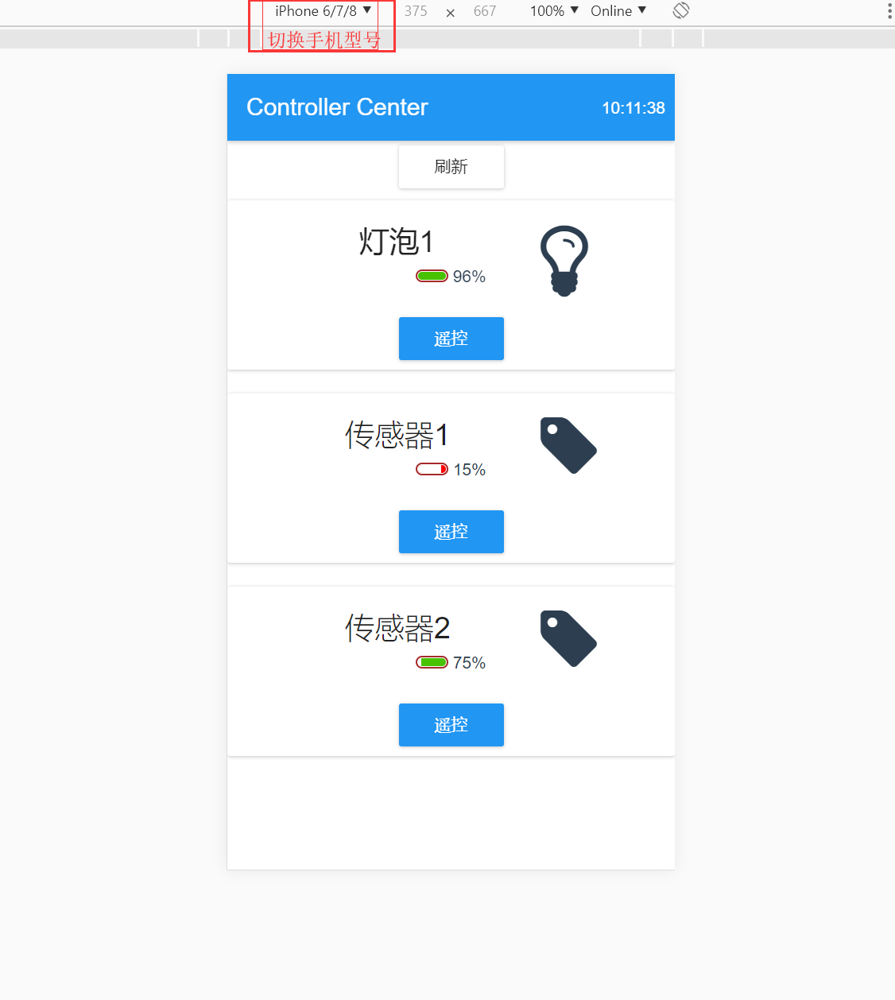
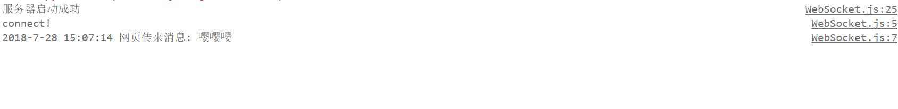
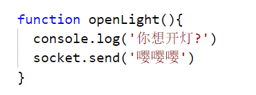
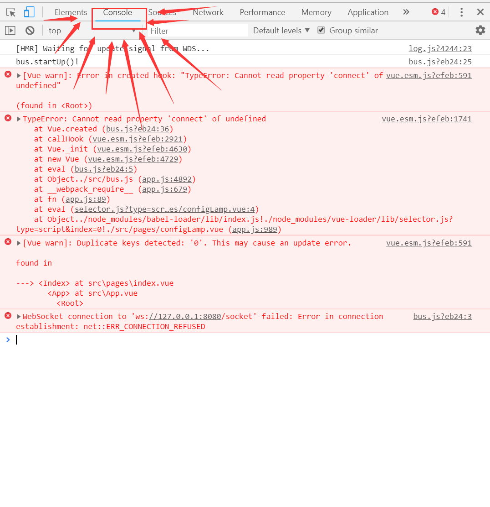

# 为智能灯准备Web界面

## 1.下载Web前端
如果电脑没有安装git, 请前往以下地址下载git并安装.

[https://gitforwindows.org/](https://gitforwindows.org/)

打开控制台终端: 
运行:
```Bash
git clone https://github.com/1079805974/NodeMCULightWeb.git
```
下载源代码.

## 2.预览Web前端
用`VS Code`打开下载好的`NodeMCULightWeb`文件夹.**打开文件夹!**  
选择 `查看->集成终端` 打开集成终端.  
运行:
```Bash
npm install
npm run dev
```
出现以下效果:


在`Google Chrome`浏览器中打开 [http://localhost:8081](http://localhost:8081)  
在浏览器界面按下`Ctrl+Shift+C`打开开发者模式.  
点击下图所示按钮, 进入手机模拟模式.

效果如下:


## 3.使用手机预览(仅供娱乐)
如果手机与电脑在同一局域网内.可以在手机浏览器中输入`电脑IP:端口号(8081)`查看界面.
如: `192.168.3.23:8081`

# 为智能灯准备Web后台

```Bash
git clone https://github.com/1079805974/NodeMCULightBackground.git
```
用`VS Code`打开文件夹.打开`./bin/LampServer.js`,运行.
> 控制台输出:服务器启动成功!

转到前端界面, 选择一个灯, 点击开关, 即可给服务器发送消息, 相关代码在`./bus.js`中, 可以自行查看.效果如下.


此处代码:


## 4.查看调试消息并修改代码
进入`Chrome`浏览器控制台.

**你可以试着点击页面, 查看控制台输出**

## 5.关闭VS Code中ESLint限制
在`VS Code`中打开`文件->首选项->设置`, 搜索`eslint`.  
将所有搜索到的选项设置为`false`.

## 6.修改代码
打开`/src/bus.js`可以看到相关输入语句, 即可写入通信逻辑.  
通信逻辑是通过WebSocket与后台通信, 建议看第七篇启动后台后进行操作.
