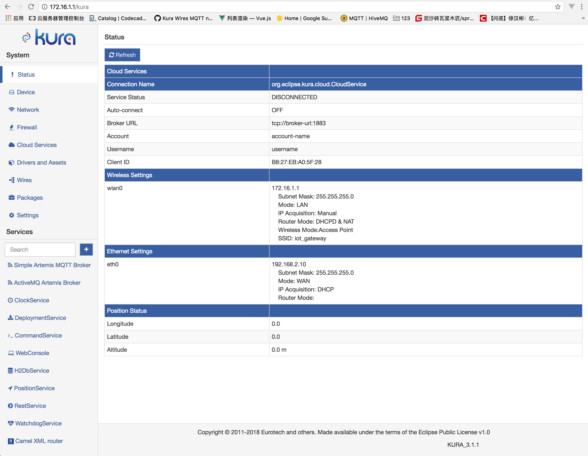
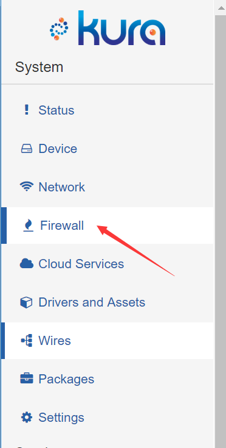
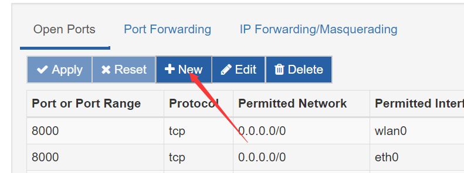
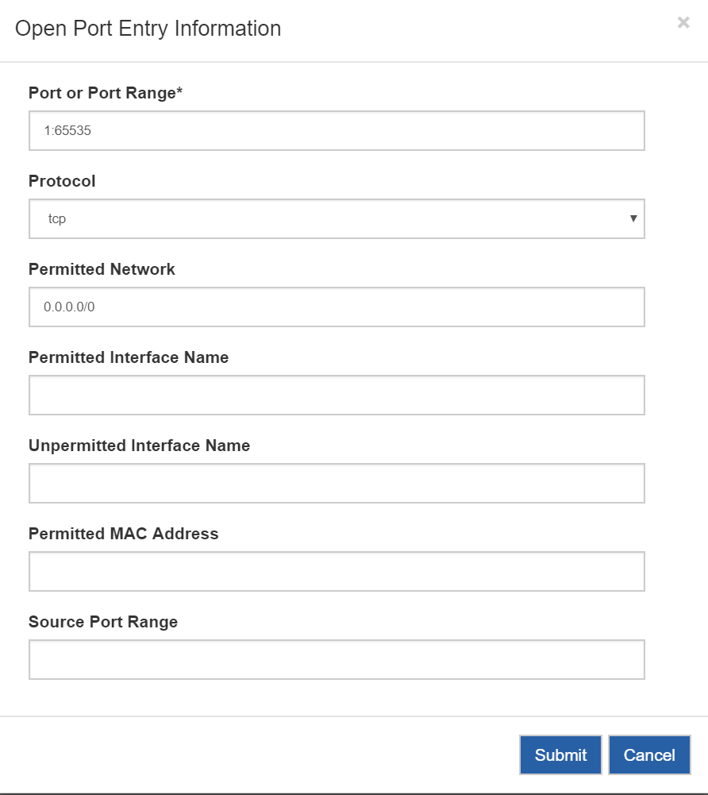
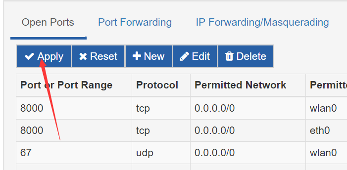

## 使用Eclipse Kura™ 将树莓派变成Wi-Fi热点

### 为树莓派安装系统
为树莓派安装系统的教程, 网络上有很多, 在此省略.

### 将Kura™安装到树莓派上
请参照[Eclipse Kura™ Installation](https://eclipse.github.io/kura/intro/raspberry-pi-quick-start.html)将Kura™安装到树莓派上

### 连接到Kura™控制台
如果您的树莓派带有显示屏, 请在浏览器中输入树莓派IP地址.  
如果您的电脑和树莓派在同一个局域网内(通过网线或Wi-Fi连接), 请在浏览器中输入树莓派IP地址.  
默认的用户名和密码是admin和admin  
`(if i remeber...)`
进入控制台中心

### 按照图示操作, 配置树莓派Wi-Fi Access Point
选择`Network`

选择`wlan0`

设置密码

### 关闭kura防火墙
按照如下所示, 关闭kura防火墙, 以免数据传输被拒绝.

按下图填写

点击`submit`
点击`apply`

### 关闭windows防火墙
百度 关闭windows防火墙
依次关闭下面三个:
![winFirewall.png]